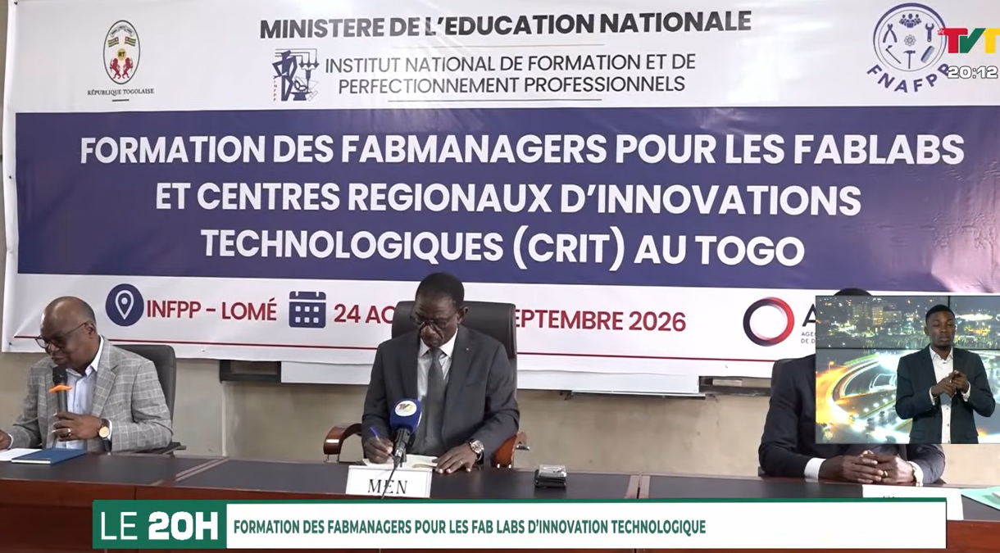
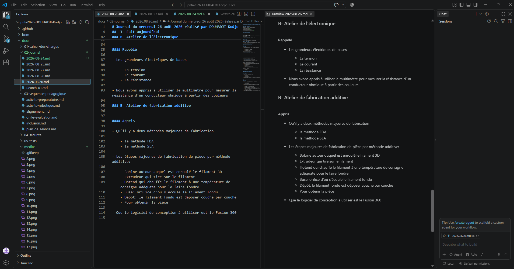

# Journal du lundi 24 août 2026 réalisé par DOUHADJI Kodjo Jules

##  I- Fait aujourd'hui

La matinée de cette journée a été marquée par un évènement majeur qu' est la phase de lancement de la formation des futurs fabmanagers en la personne de monsieur le ministre de l'éducation nationale Mama OMOROU.

### A- Atelier de fabrication additive
---

#### 1- Appris

- Le soir de cette journée, il a été question de documentation et de son importance en faveur du travail collaboratif

- Nous avons de ce fait installé le logiciel **VS Code** et appris le markdown qui nous permettra de documenter nos projets en local grâce à **git** et l'envoyer en ligne sur **github**

