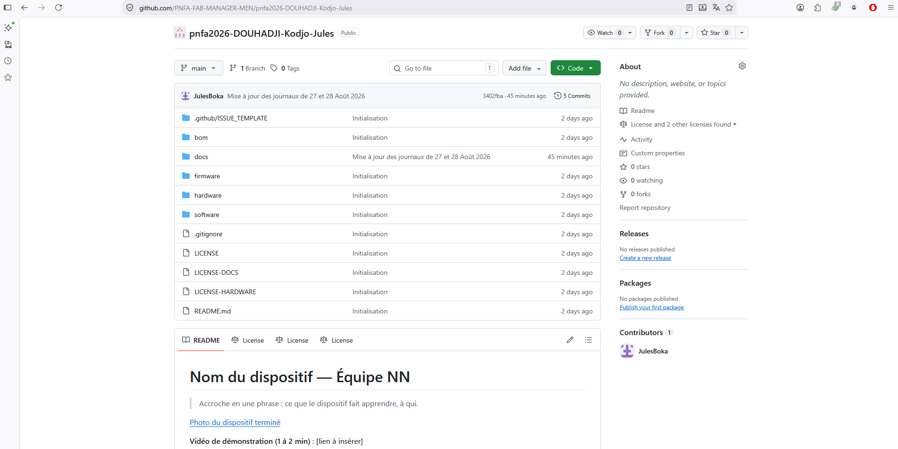

# Journal du mardi 25 août 2026 réalisé par DOUHADJI Kodjo Jules

##  I- Fait aujourd'hui

- Aujourd'hui, nous avons pratiquer davantage  la documentation grâce au markdown pour écrire nos journaux

- ensuite nous avons créer nos comptes gitHub, rejoins l'organisation **PNFA FAB MANAGER MEN**, créé notre répertoire public dans l'organisation, puis connecté VS Code à gitHub pour envoyer nos fichiers locaux en ligne

