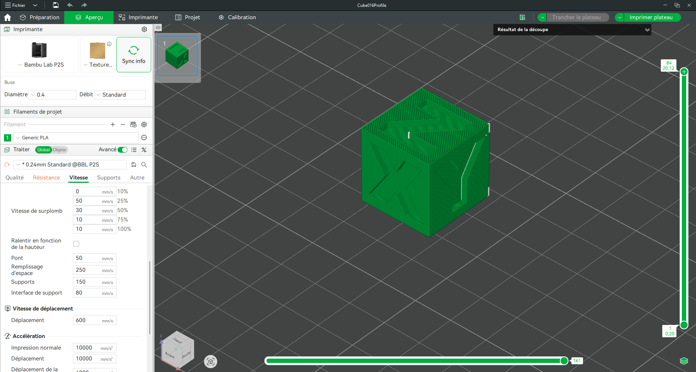
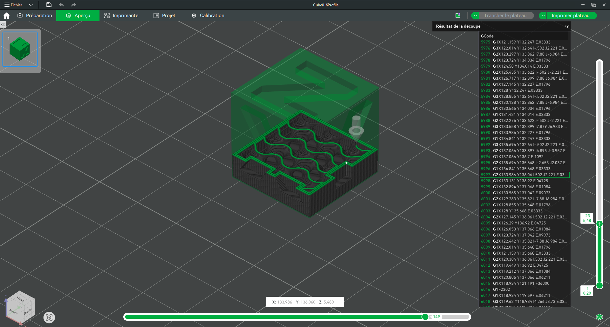
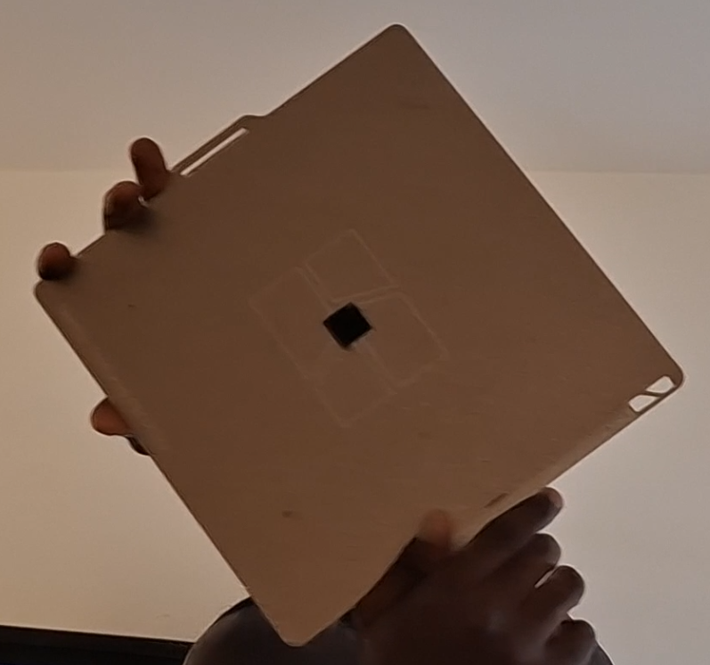
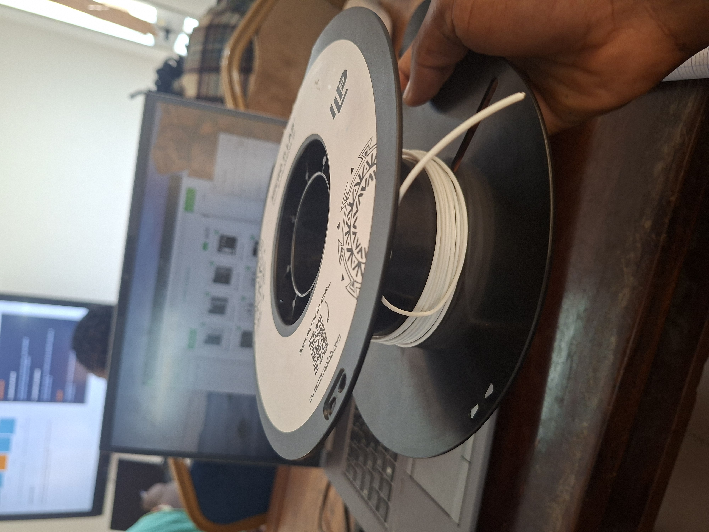
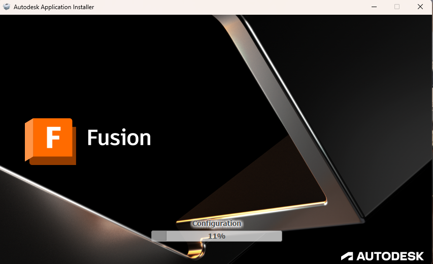
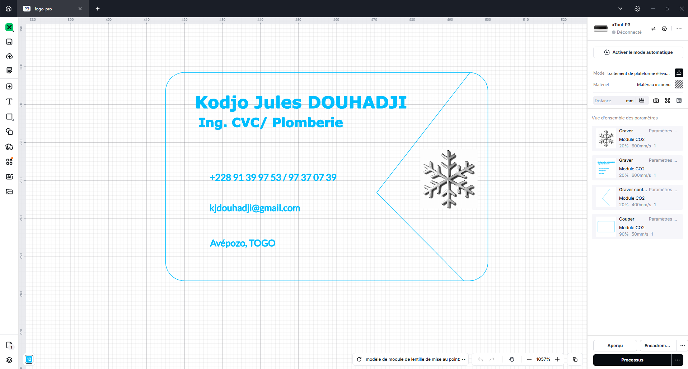
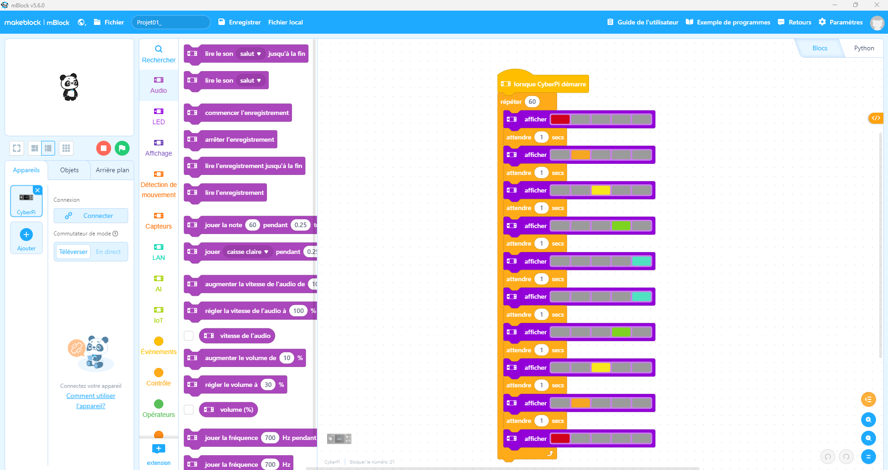

# Journal du jeudi 27 août 2026 réalisé par DOUHADJI Kodjo Jules

##  I- Fait aujourd'hui

Aujourd'hui nous avons reparcouru l'atelier:

1: de fabrication additive

### A- Atelier de fabrication additive
---

#### 1- Appris

- Nous avons installer le logiciel de slicing Bambu studio qui fut ensuite installé
- Nous avons aussi installé le Prusa Slice
- Un projet STL préconçu, nous a été copié nommé Cube016Profile que nous avons ouvert dans Bambu studio
- Nous avons fait les paramétrages:

    - Sélection de machine d'impression
    - Sélection du filament
    - Sélectionne de l'épaisseur de la taille du filament
    - La plupart des autres paramétrages laissés par défaut
    - Génération du G-code 
    - Lancement de l'impression

## Les médias de l'atelier

Interface et paramétrages

Slicing et génération du G-Code

Première impression 3D

Première impression 3D

### B- Atelier de projet
---

#### 1- Appris

- Nous avons copié et installer le logiciel fusion 360

Installation de fusion 360

## Les médias de l'atelier

Interface et paramétrages

### B- Atelier de découpe laser
---

#### 1- Appris

- Nous avons réaliser notre première carte de visite de 85mm x 55 mm avec le logiciel Xtool

Carte de visite

- Ensuite, on nous a enseigné les paramètres à utiliser pour lancer la découpe avec la découpeuse laser P3

| Paramètre | Graver contour | Graver | Couper |
|:-:|:-:|:-:|:-:|
| Vitesse | 20 | 20 | 90 |
| Puissance | 400 | 600 | 50 |
---

### B- Atelier de'électronique
---

#### 1- Appris

- Nous avons parler de CyberPi & et de l'écosystème mBuild

- Nous avons installé le logiciel V5 et ses drivers **Fichier CH34**

- Nous avons vu certains composants de l'écosystème mBuild:

    - CyberPi
    - Capteur de lumière
    - Capteur ultrason
    - Capteur de pression
    - Capteur de température et d'humidité

- Nous avons vu la différence entre un capteur et un actionneur

- Pour finir nous avons réaliser une connexion entre le CyberPi et notre PC et à l'aide du logiciel V5, nous avons écris le premier programme pour afficher les LEDs du CyberPi

