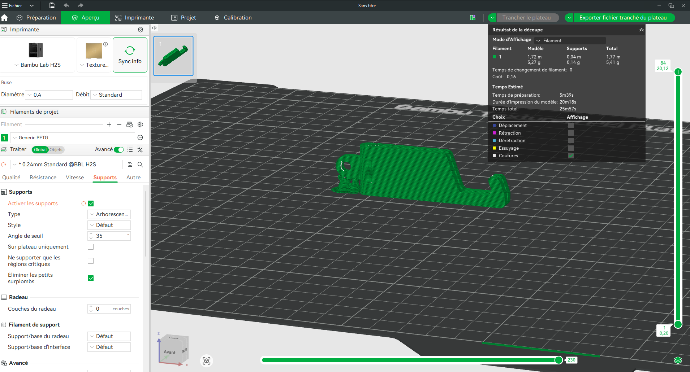
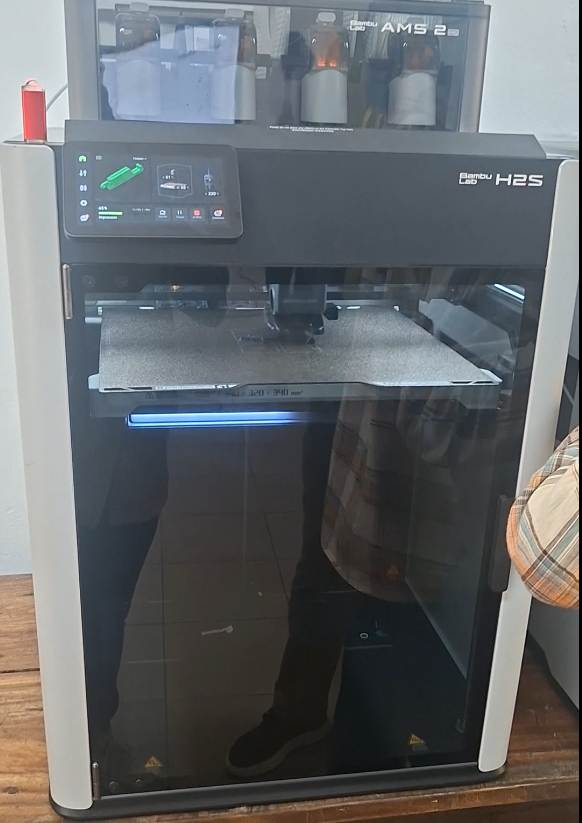
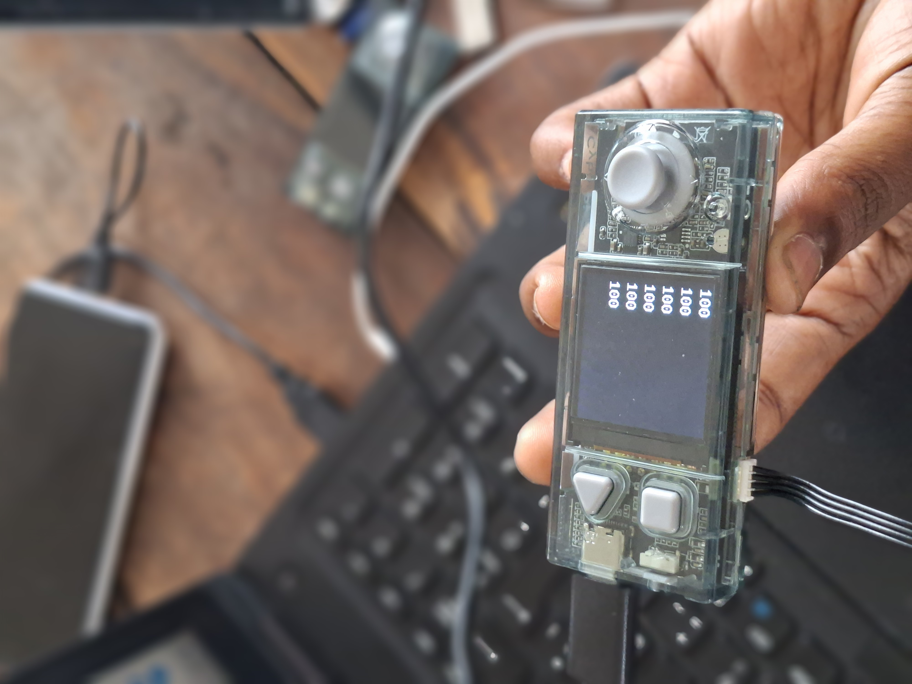
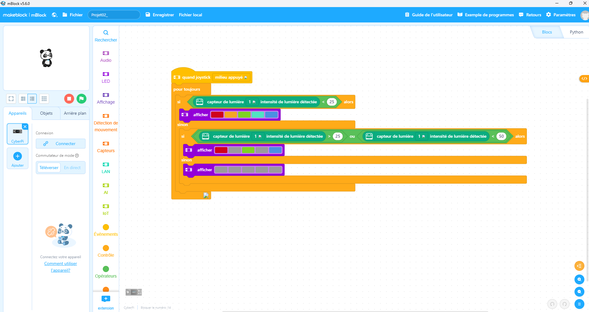
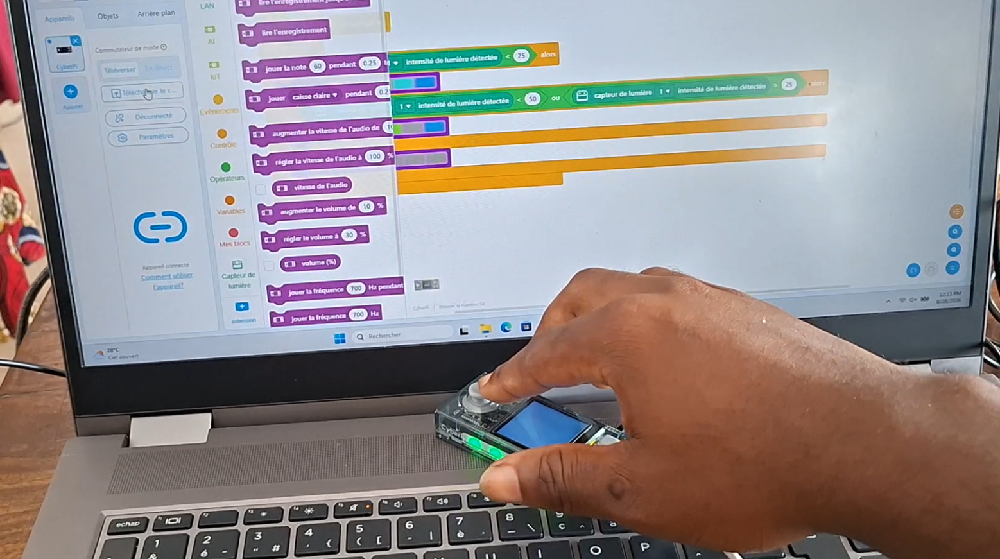

# Journal du vendredi 28 août 2026

##  I- Fait aujourd'hui

### A- Atelier de découpe Laser
---

#### 1- Appris

- Nous avons fait des travaux personnels et les formateurs ont lancé les impressions faites hier, ce qui va prendre pas mal de temps, minimum 1h

### B- Atelier de fabrication additive
---

#### 1- Appris

- Nous avons copié de conception nommé **Foldable_Phone_Stand_Bambu**

- Nous avons appris à paramétrer davantage l'impression dans Bambu Studio et nous avons lancer la première impression sur l'imprimante **H2S** 

Paramétrages et slicing dans Bambu Studio

Impression 3D sur H2S

### C- Atelier de'électronique
---

#### 1- Appris

- Aujourd'hui nous avons fait un atelier pratique, où il était question de faire les câblages et de d'écrire le programme pour allumer les Leds uniquement s'il fait jour

- Avant cela nous avons afficher les données affichées par le capteur de lumière

Données du capteur en faisant varier la lumière arrivant à son LED

Commande de l'atelier pratique

### D- Atelier de projet
---

#### 1- Appris

- Nous avons parler de deux méthodes qui permettent de réaliser les projets de fabrication numérique depuis l'idée jusqu'à sa réalisation:

    - Le Design Thinking
    - La méthode spirale

#### Spécificités des deux méthodes

Le Design Thinking place l'humain au centre. Axé sur l'empathie, il résout des problèmes complexes en comprenant les besoins réels des utilisateurs. Son processus est non linéaire et comprends cinq étapes: *empathie*, *définition*, *idéation*, *prototype*, *test* 

La méthode en spirale quant à elle progresse par cycles répétitifs. Chaque boucle agrandit le projet tout en sécurisant les investissements.