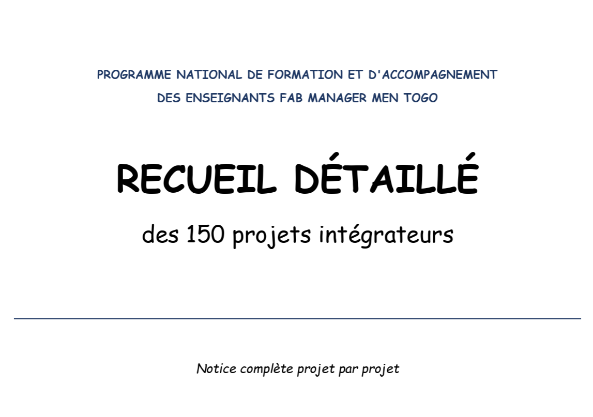

# Journal du lundi 29 août 2026 réalisé par DOUHADJI Kodjo Jules

##  I- Fait aujourd'hui

- Une liste de 150 projets nous a été envoyée pour que les 25 groupes chacun puisse en choisir 01

- Il nous a été demandé à ce que le projet sélectionné s'inscrive dans l'univers éducatif et atteignable dans le temps

- Nous sommes **le groupe 6** et le projet que nous avons choisi c'est de réaliser **un rapporteur d'angle numérique**

- Nous sommes pitcher le projet et les camarades nous ont challengé sur ça avec des questions

####  A faire

- Il nous a ensuite été demandé de réaliser **la fiche de projet** pour le lundi