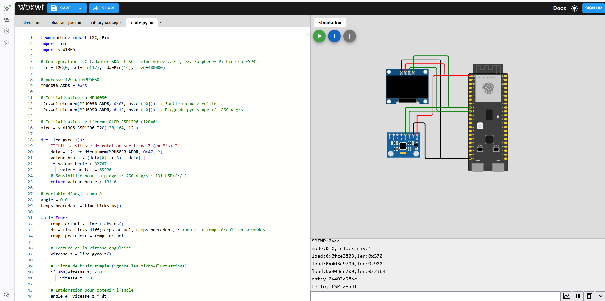
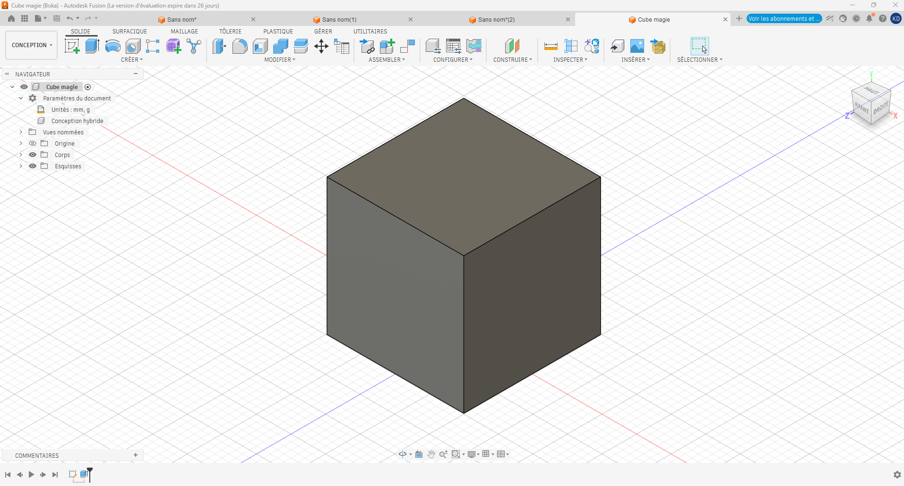

# Journal du mercredi 31 août 2026 réalisé par DOUHADJI Kodjo Jules

##  I- Fait aujourd'hui

La matinée il a été question de travailler sur nos projets respectifs:

- Dans un premier temps nous avons établi la liste des matériels à utiliser. Cela se résume à:
    - ESP32 S3,
    - Acrylique
    - Capteur AS5600
    - Ecran OLED 0.91 “
    - Pile de 18650 avec Module à charge
    - Plaquette SK10
    - Fil de connexion .

- Ensuite il a été question de voir comment les connecter ensemble

- Nos recherches nous ont conduit à la plateforme en ligne Wokwi qui permet de faire la simulation électronique en ligne
Cablage, utilisation de Wokwi une appli ou un site  pour la simulation de câblage des moteurs.

- Nous nous sommes vite confronter à un problème. Dans la bibliothèque de Wokwi le capteur que nous voulons utiliser (**Capteur AS5600**) n'est pas disponible;

- Problème auquel nous avons trouvé une alternative qui est d'utiliser **le capteur MPU6050**

- Au début, on a eu des petits soucis :
On souhaite câbler le ESP32 avec le MPU6050 au LED. Nous sommes rapidement limités par nos connaissances car ne sachant pas comment ces composants fonctionnent.

- Après recherche, on a compris que :

    - GND : c’est la masse.
    - SCL : serial clock line . Il donne le signal de départ à l'ESP32-S3.
    - SDA : serial data line. Il envoie les données au ESP32-S3 pour l’affichage à l’écran.

- L’étape suivante a été de réussir à afficher une donnée du capteur sur l’écran du OLED à l'aide du language **microPython**.

- Au début, ça avait échoué car le câblage du SDA et SCL du OLED et du MPU6050 était effectué sur des GPIO différents au niveau  de l'ESP32.

- Après avoir compris et modifié l’écran affichait alors des données du programme que l’on lui avait envoyé .

#### À faire demain

- Il a été demandé de faire davantage de recherche sur les données envoyées par le MPU6050 à l'ESP32 afin de savoir comment l'exploiter pour faire afficher nos angles à l'écran.

##  II- Fait aujourd'hui (Atelier de projet)

- Nous avons appris à nous familiariser avec l'interface du logiciel **Fusion 360** grâce auquel nous avons réaliser notre première modélisation 3D nommée **Cube magie**

---
### Fin