# Journal du mercredi 26 août 2026 réalisé par DOUHADJI Kodjo Jules

##  I- Fait aujourd'hui

Aujourd'hui nous avons des ateliers:

1: Atelier de DTF avec xTool  
2: Atelier électronique  
3: Atelier de CAO

### A- Atelier de DTF avec xTool
---

#### 1- Appris

- Que l'imprimante à utiliser est l'imprimante **DTF xTool**

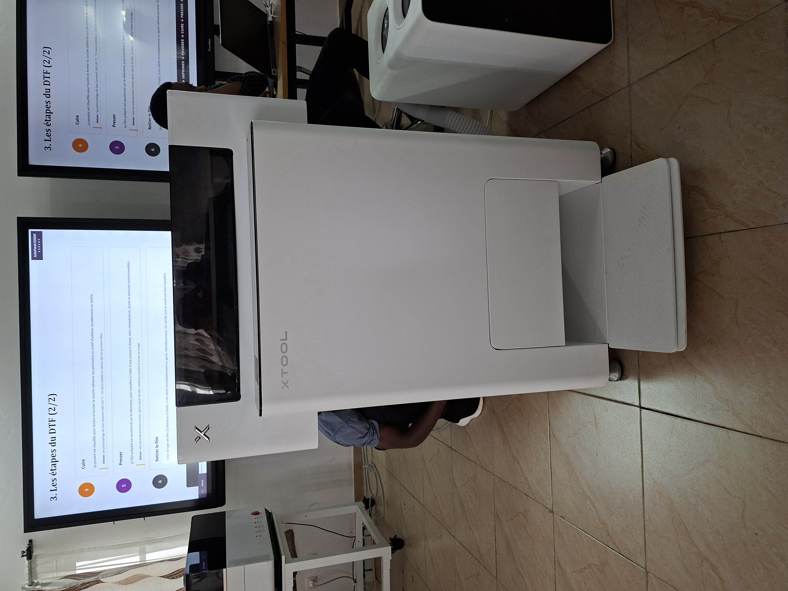

- Le motif à imprimer est conçu dans le logiciel xTool

- Puis imprimer à l'envers sur le film DTF

- Ensuite ça passe à la phase de saupoudrage

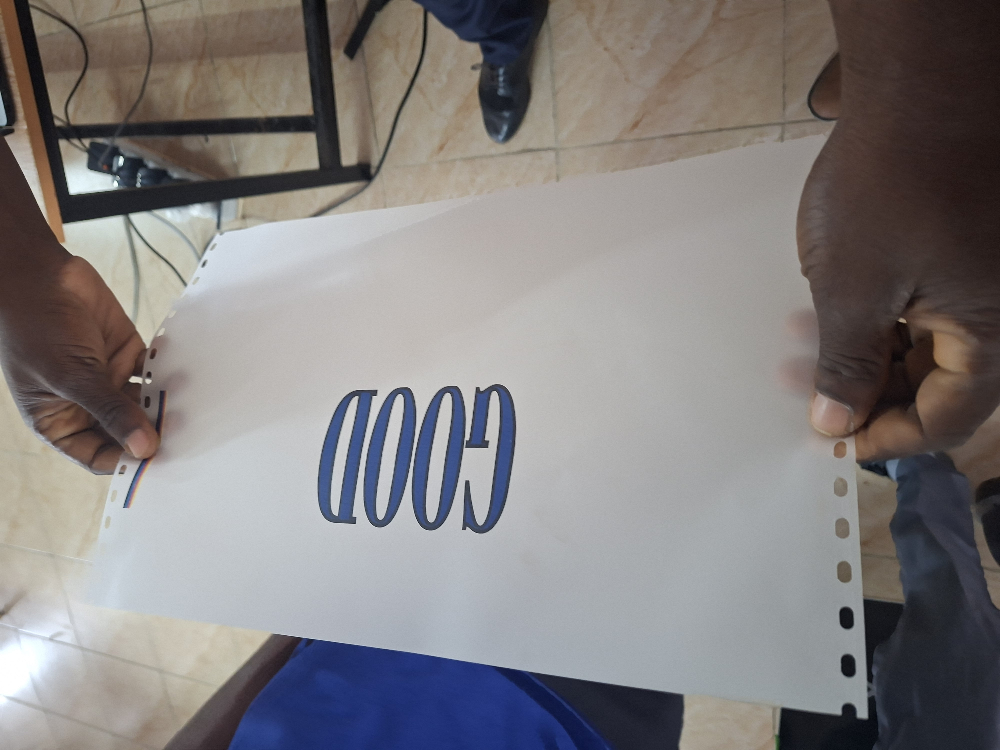

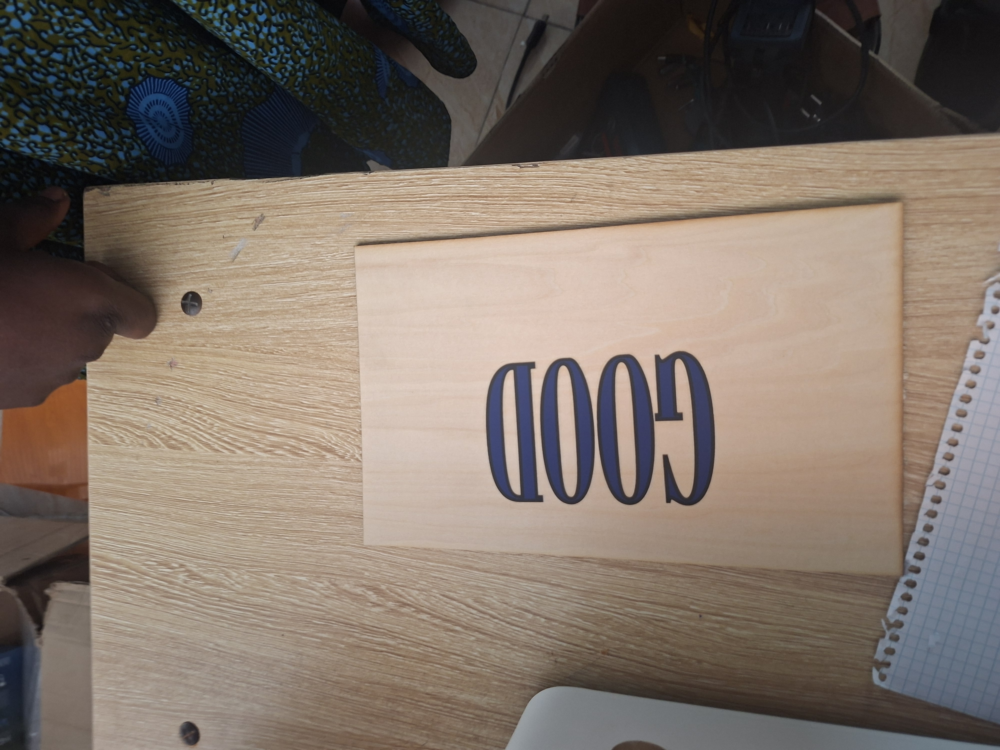

- Puis à la pression pour coller sur l'objet directement

- Ensuite on retire le film

##### Les grandes étapes de l'impression DTF sont:

- Conçevoir

- Imprimer

- Poudre

- Cuire

- Presser

- Retirer le film

**REMARQUE**: Ne jamais déposer le motif directement sur le vêtement.

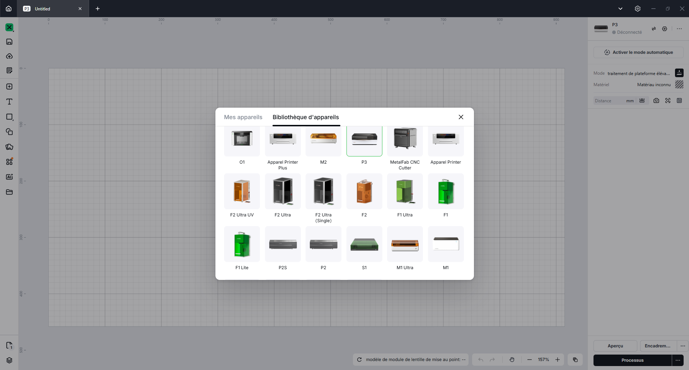
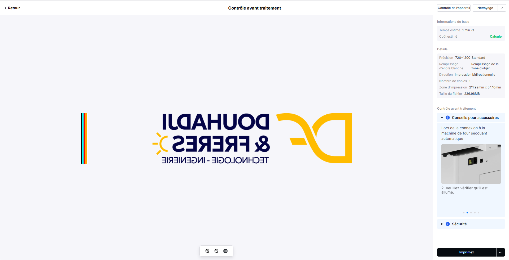

### B- Atelier d'électronique
---

#### Appris

- Dans cet atelier, il a été question d'arriver à câbler sur la plaquette SK10 et de comprendre le schéma de cablage

- Nous avons réussi à câbler quatre schémas:

Schéma 1

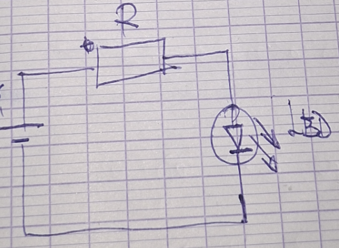

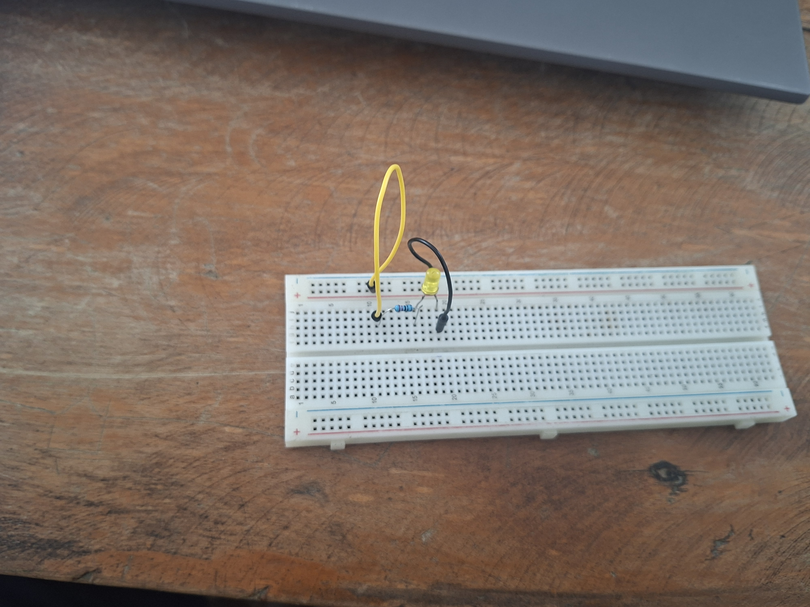

Schéma 2

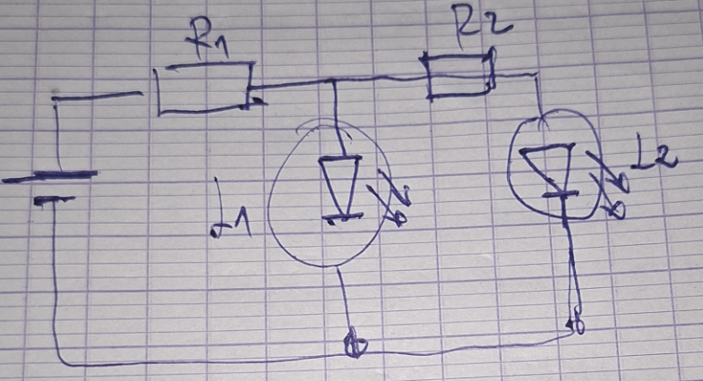

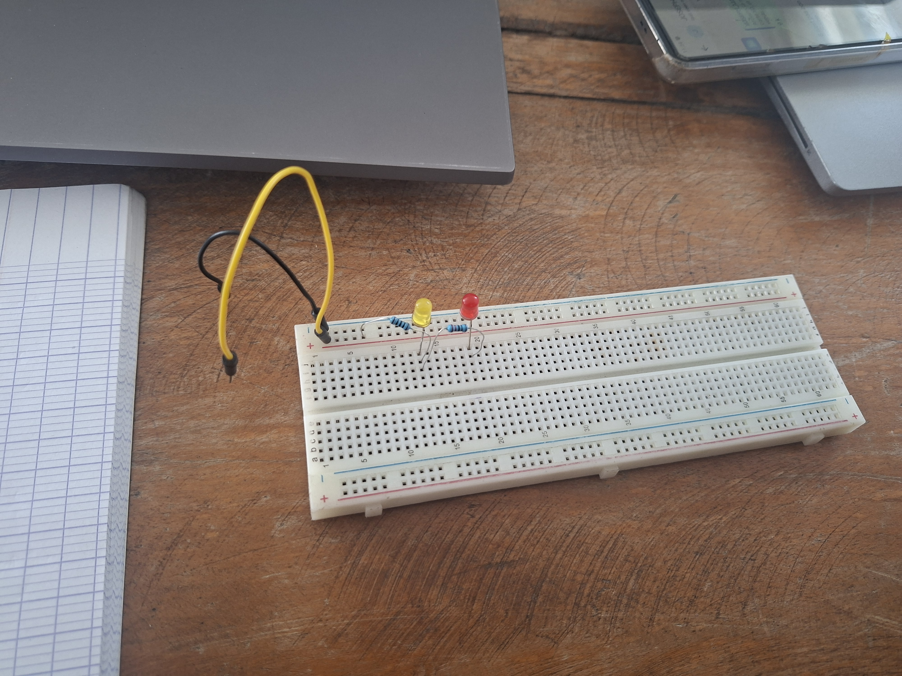

Schéma 3

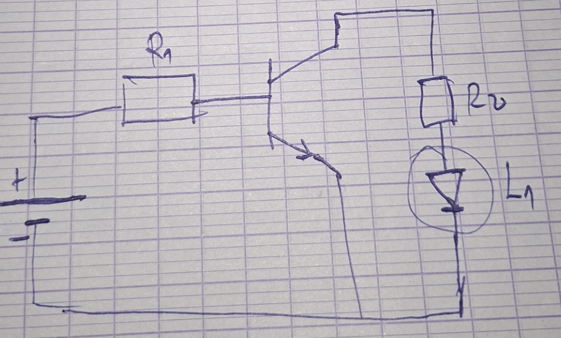

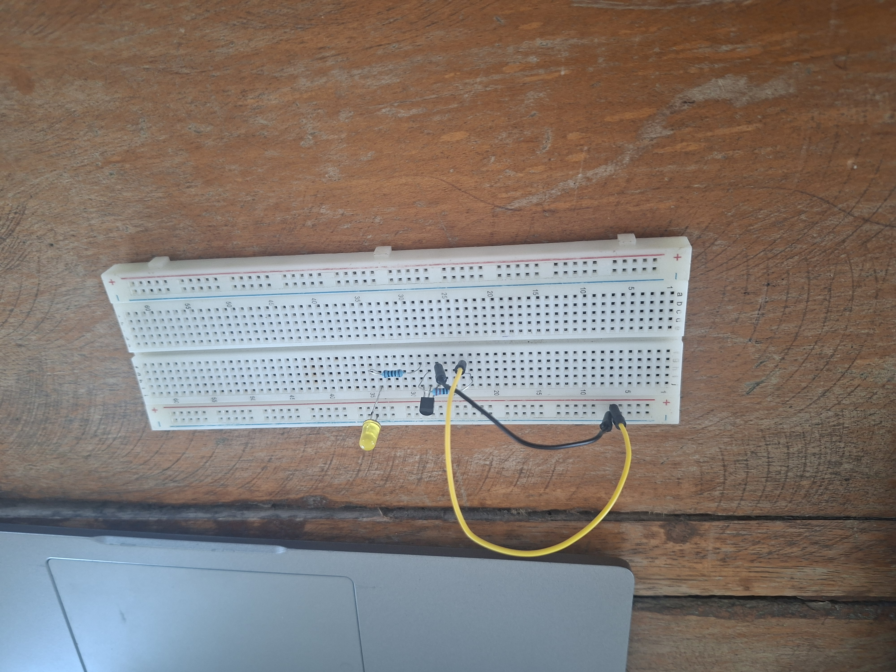

Schéma 4

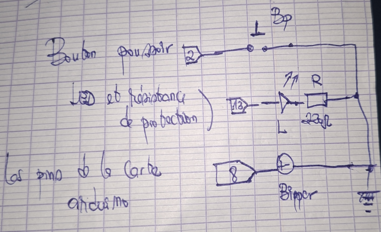

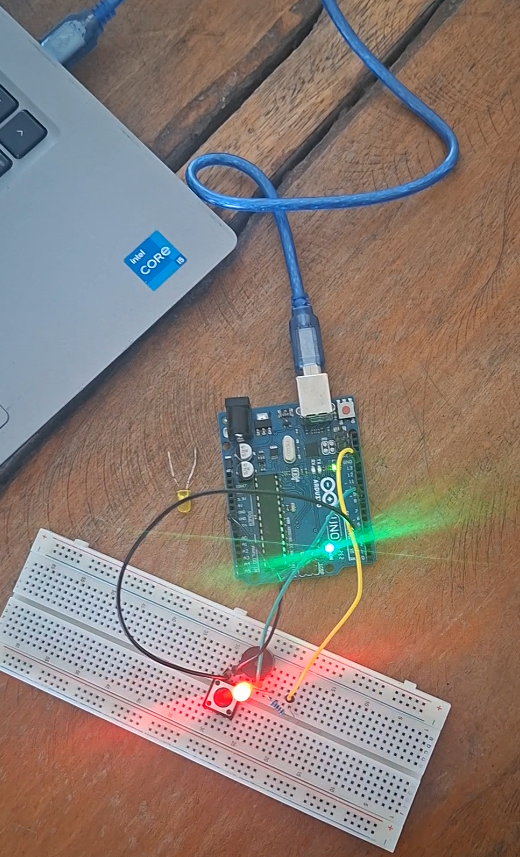

### B- Atelier de CAO
---

#### Appris

- Nous avons continuer avec l'exploration du logiciel Fusion 360 notamment l'utilisation des fonctions bossage, congé, écriture de texte

- Nous sommes arrivés à réaliser deux pièces:

    - Une porte clé
    - Un palier

Porte clé

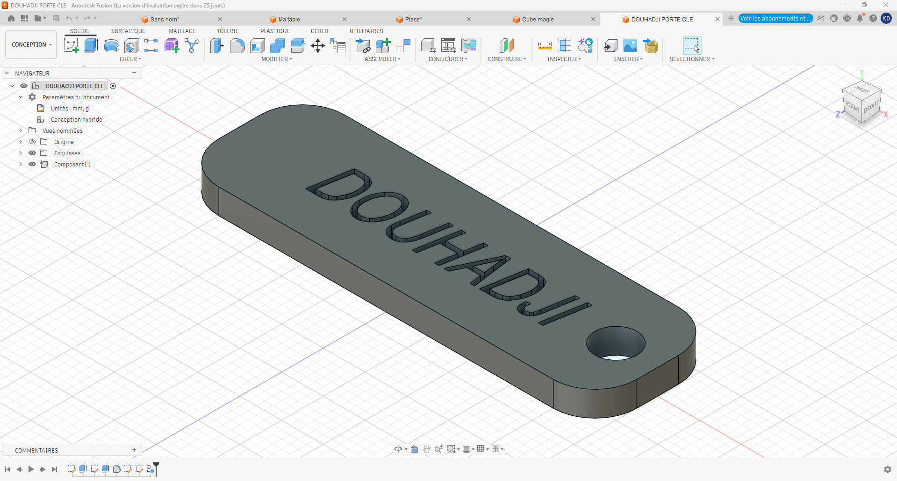

Palier

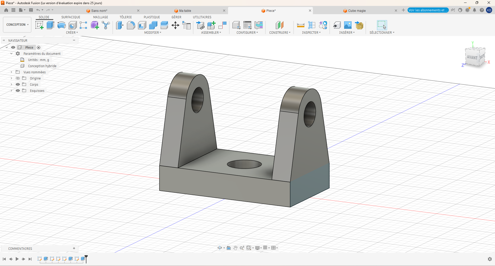

