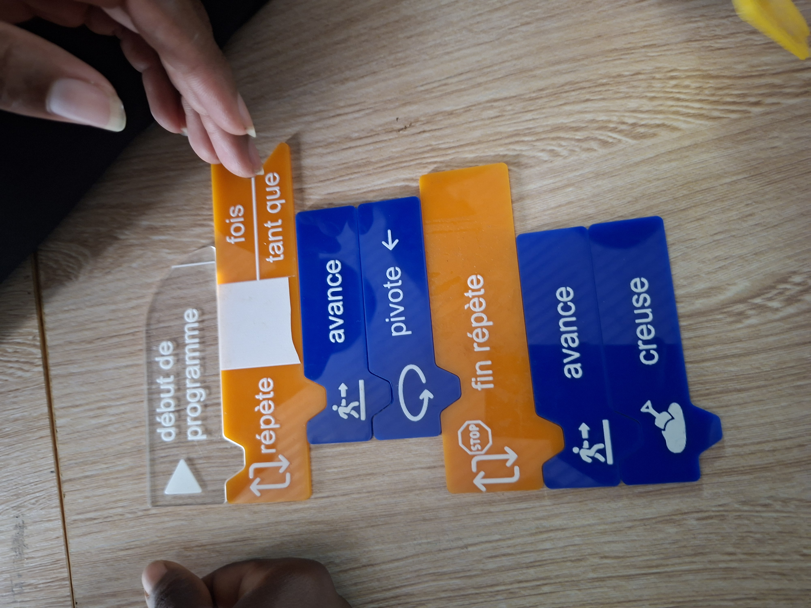
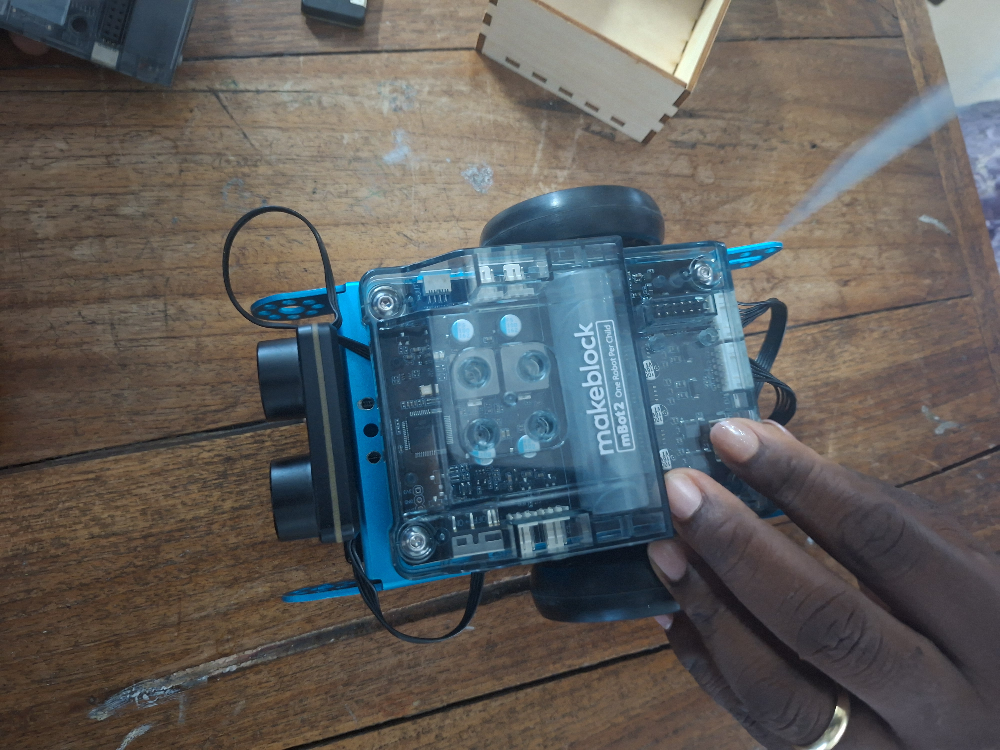
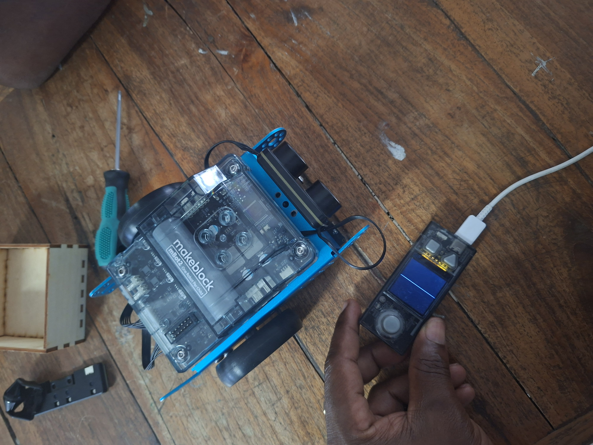
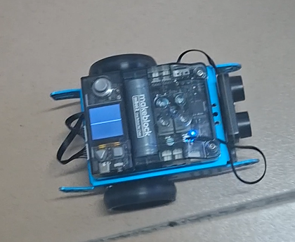
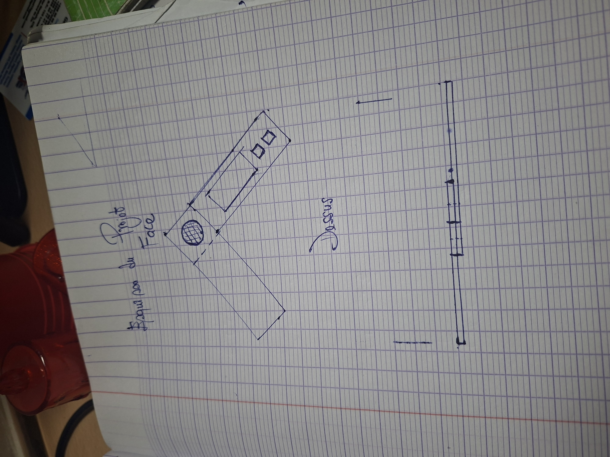

# Journal du mercredi 02 Septembre 2026 réalisé par DOUHADJI Kodjo Jules

##  I- Fait aujourd'hui

Aujourd'hui nous avons des ateliers:

1: Atelier de l'algorithme débranchée  
2: Atelier électronique  
3: Atelier de projet

### A- Atelier de l'algorithme débranchée
---

#### 1- Appris

- Nous avons appris le fait qu'un algorithme est une suite logique d'instruction non ambigüe pour effectuer une tâche.

- A la différence qu'un algorithme débranché permet de faire de l'algorithme sans utiliser la machine.

- Les critères d'un bon algorithme sont:

    - Une suite ordonnée d'instructions

    - Un nombre fini d'étapes

    - Des instructions précises qui résolvent un problème donné.

- Nous sommes passés à la pratique, en utilisant la programmation par block pour retrouver **un trésor**

### B- Atelier d'électronique
---

#### Appris

- Dans cet atelier, il a été question d'arriver à monter le robot mBot et à le commander son déplacement grâce à la programmation par block

Animation

### C- Atelier de projet
---

#### Appris

- Ici il nous a été de réaliser une première esquisse pour notre projet

Esquisse

