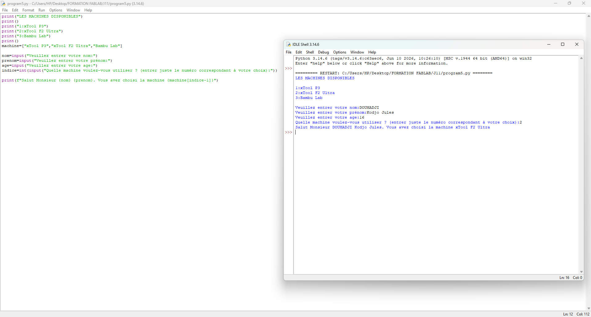
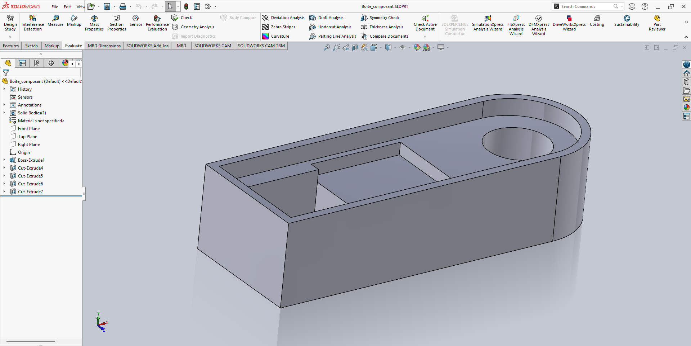

# Journal du mercredi 03 Septembre 2026 réalisé par DOUHADJI Kodjo Jules

##  I- Fait aujourd'hui

Aujourd'hui nous avons des ateliers:

1: Atelier de programmation Python  
2: Atelier de projet

### A- Atelier de programmation Python
---

#### 1- Appris

- Nous avons appris les syntaxes de base en Python. Notamment à afficher du texte avec print, à récupérer la saisie utilisateur, à découvrir ce que c'est que des variables

- Il nous a été de réaliser un formulaire de réservation en Python pour nos futurs Fablab, en permettant à l'utilisateur de saisir, son nom, prénom, son âge, la machine à utiliser et de les affihcer ensuite

### B- Atelier de projet
---

#### Fait

- Dans cet atelier, nous avons affiner nos idées sur les composants électroniques que nous allons utiliser, leurs dispositions internes et passer à une première modélisation du boîtier électronique.

