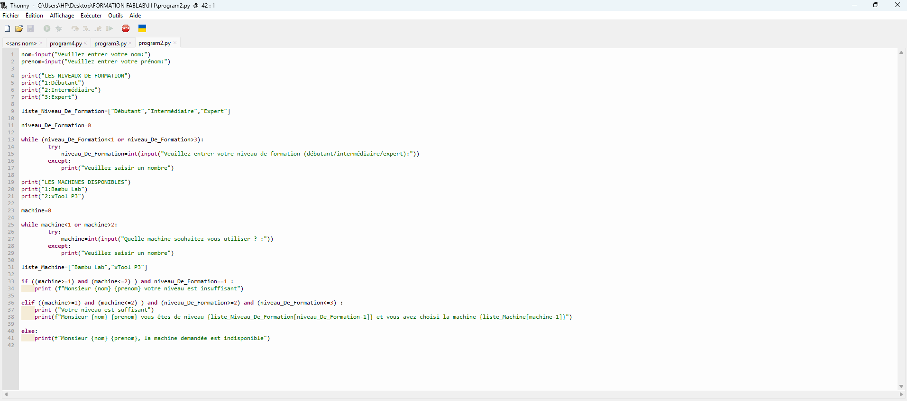
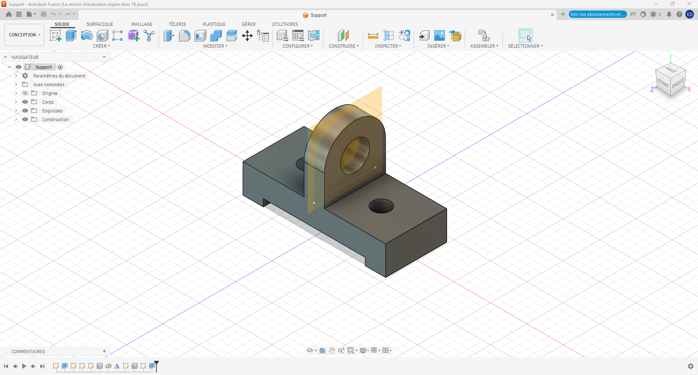
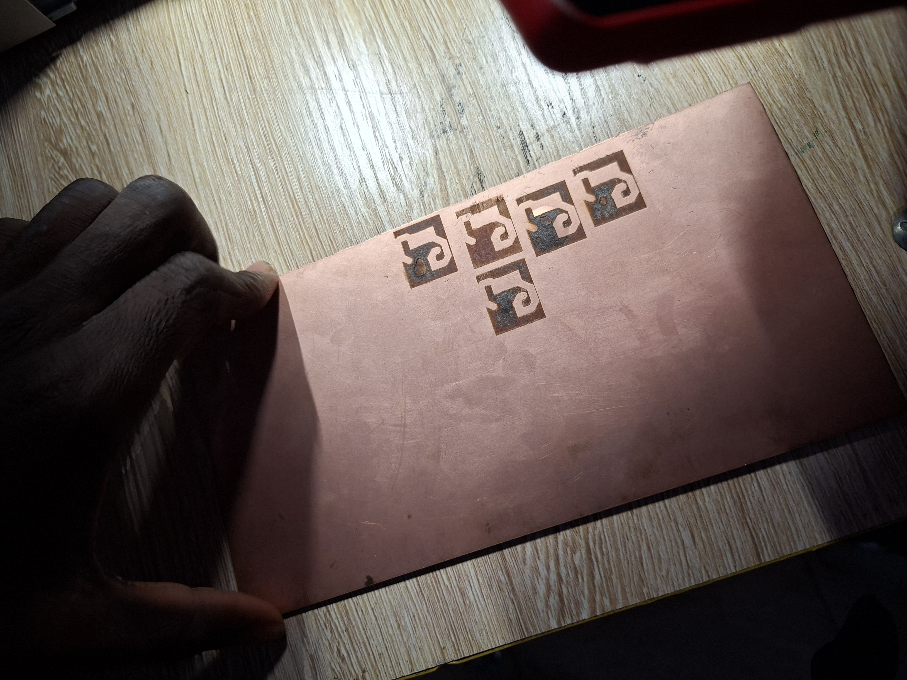

# Journal du mercredi 04 Septembre 2026 réalisé par DOUHADJI Kodjo Jules

##  I- Fait aujourd'hui

Aujourd'hui nous avons fait trois (03) ateliers:

1: Atelier de programmation Python  
2: Atelier de projet Fusion  
3: Atelier de PCB

### A- Atelier de programmation Python
---

#### 1- Appris

- Nous avons approfondi ce que nous avons appris hier en Python, en étudiant les structure de contrôle conditionnelles **if**, **elif**, **else**

- Nous avons également parlé de boucle, en se servant de **for** ou de **while**

- Nous avons vu également ce que s'est que **les listes**, **les tuples**, **les dictionnaires**

- Nous nous sommes servis de tout ça pour écrire un programme qui demande à l'utilisateur de renseigner son niveau entre débutant/intermédiaire/avancé, affiche la liste des machines disponibles dans le Fablab et dit si son niveau est satisfaisant pour utiliser la machine ou pas 

### B- Atelier de Fusion
---

#### 1- Appris

- Dans cet atelier, nous avons mis toutes les connaissances apprises pour modéliser une pièce

### C- Atelier de PCB
---

#### 1- Appris

- Dans cet atelier, nous avons fait les généralités sur les PCB notamment:

    - ce que c'est: une plaque qui relie électriquement les composants électroniques

    - pourquoi l'utiliser: pour avoir un circuit fiable, compact et reproductible, sans câblage manuel

    - les étapes de réalisation

    - les méthodes de fabrication

- A la fin, nous avons réaliser notre premier PCB

