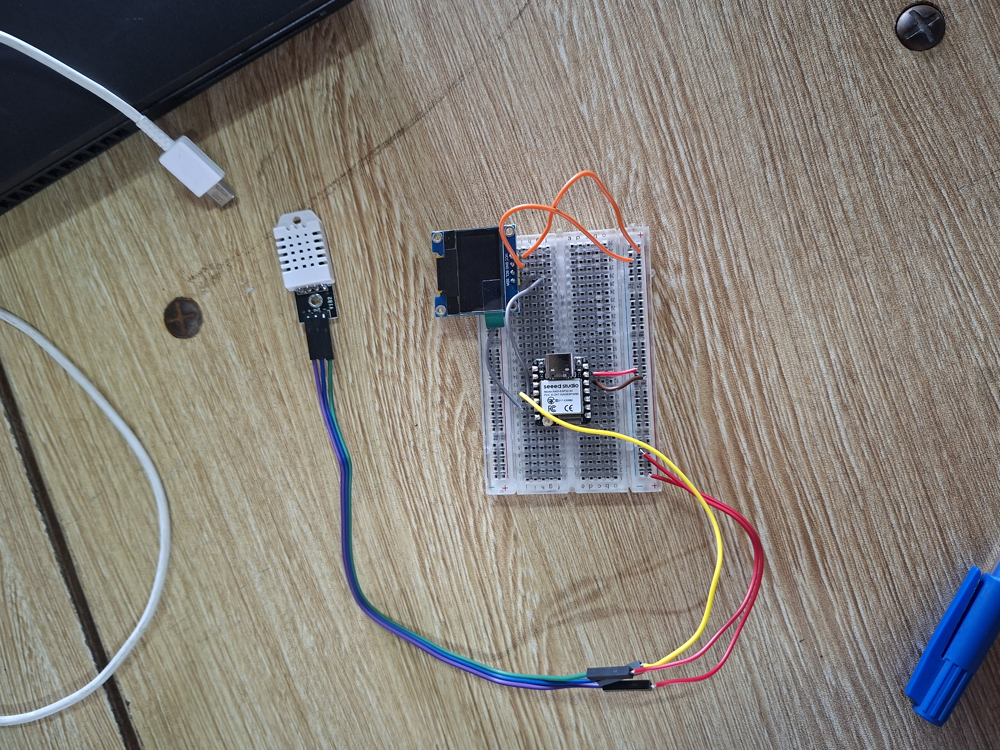
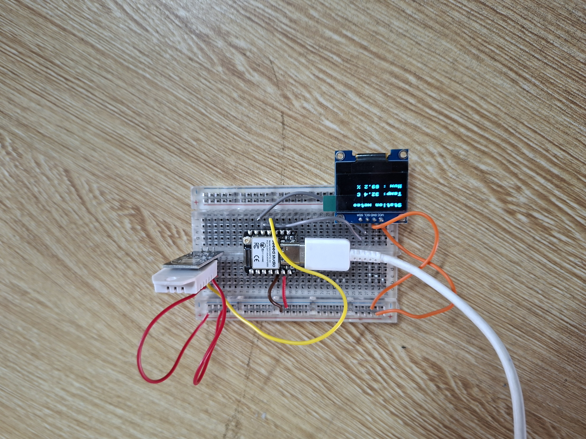

# Journal du mercredi 05 Septembre 2026 réalisé par DOUHADJI Kodjo Jules

##  I- Fait aujourd'hui

Aujourd'hui nous avons fait un (01) atelier:

1: Atelier d'électronique  

### A- Atelier de programmation Python
---

#### 1- Appris

- Nous avons fait un atelier pratique: réalisation  d'une station  météo qui affiche la température et l'humidité sur un écran à l'aide d'une plaquette **SK10**

