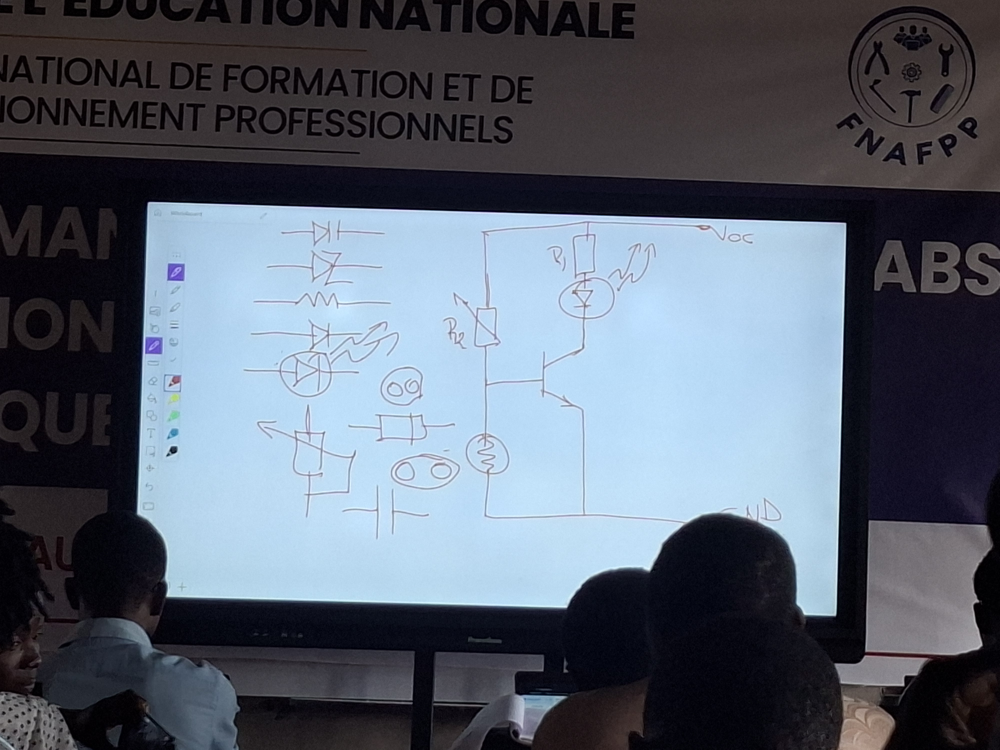
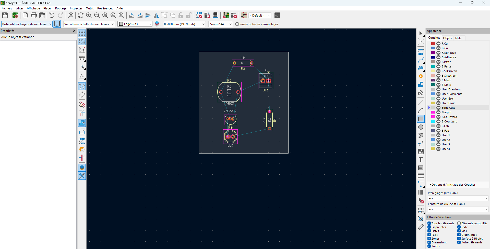
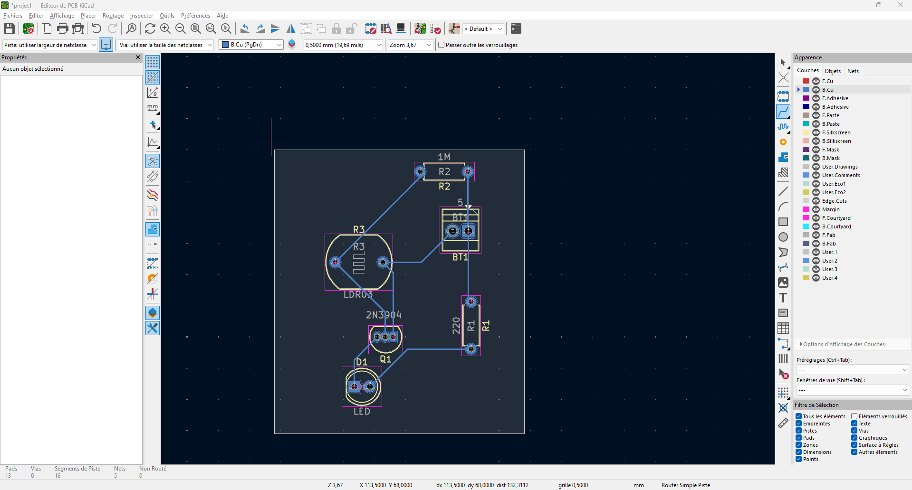
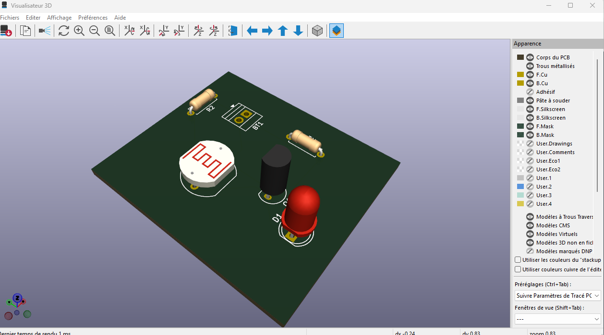

# Journal du mercredi 07 Septembre 2026 réalisé par DOUHADJI Kodjo Jules

##  I- Fait aujourd'hui

Aujourd'hui nous avons fait un (01) atelier:

1: Atelier de PCB  

### A- Atelier de programmation Python
---

#### 1- Appris

- Nous avons appris le bien fondé d'utiliser les circuits imprimés, contre la méthode de câblage habituelle utilisant la plaquette SK10

- Nous avons ensuite installé le logiciel Kicad qui nous a servi à faire le schéma de notre premier projet PCB

