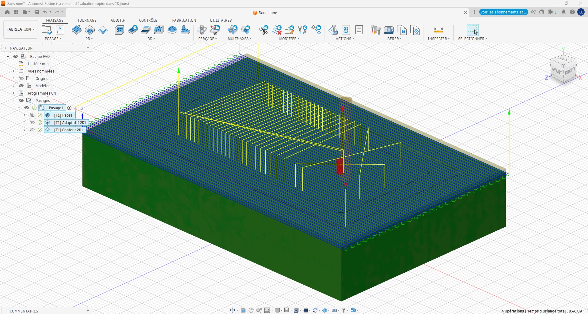
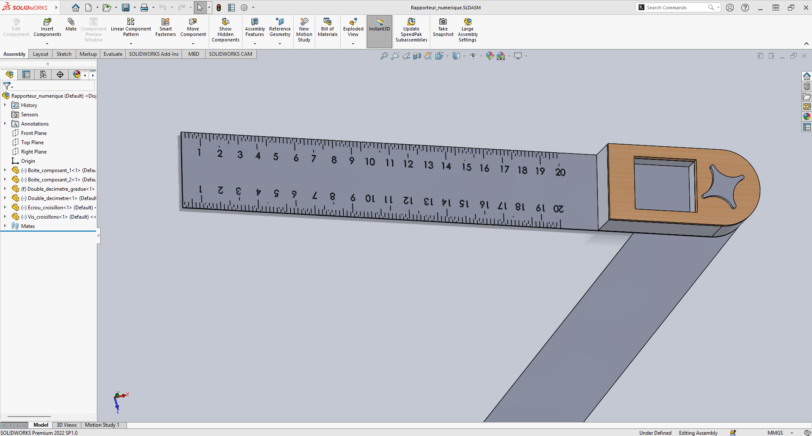

# Journal du mercredi 08 Septembre 2026 réalisé par DOUHADJI Kodjo Jules

##  I- Fait aujourd'hui

Aujourd'hui nous avons fait un (01) atelier:

1: Atelier de Fusion  
2: Projet

### A- Atelier de Fusion
---

#### 1- Appris

- Nous avons appris à faire de la fabrication assistée par ordinateur à l'aide de Fusion 360

- Il a été question notamment comment faire les paramétrages pour le posage, la face, le contour adaptatif, le contour afin de générer le G-Code qui sera utiliser pour fabriquer la pièce

- Dans ce cas, la pièce sera obtenue avec la méthode de fabrication soustractive par un **CNC**

### B- Projet
---

#### 1- Appris

- Nous avons évoluer sur nos projets respectifs

- Pour notre cas, nous avons évoluer sur le modèle 3D du projet

