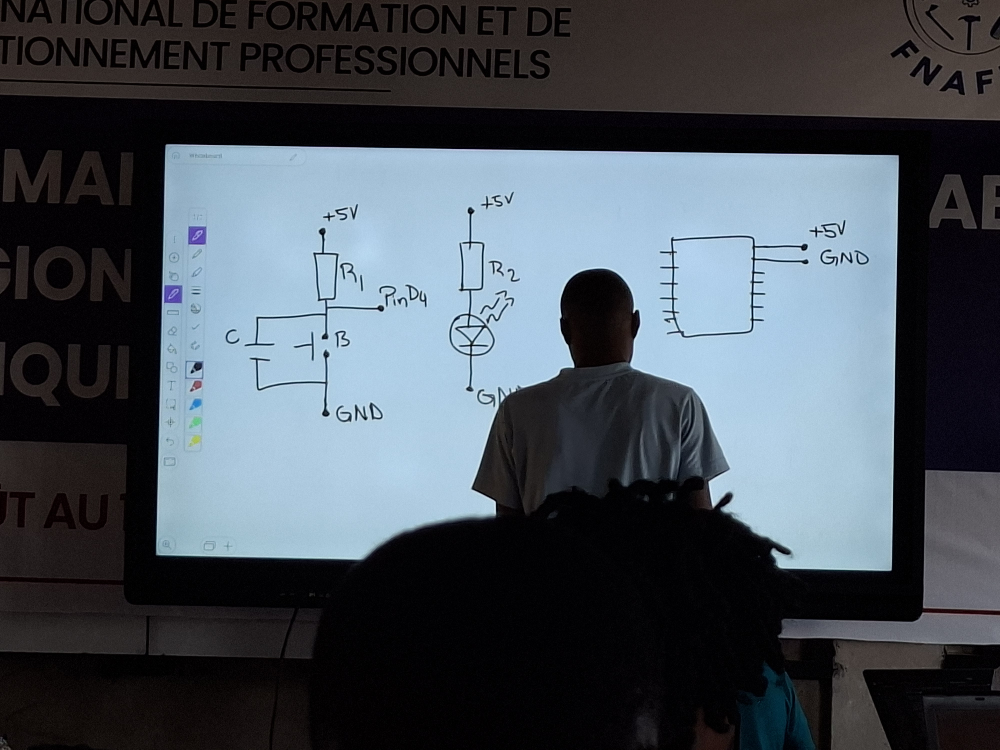
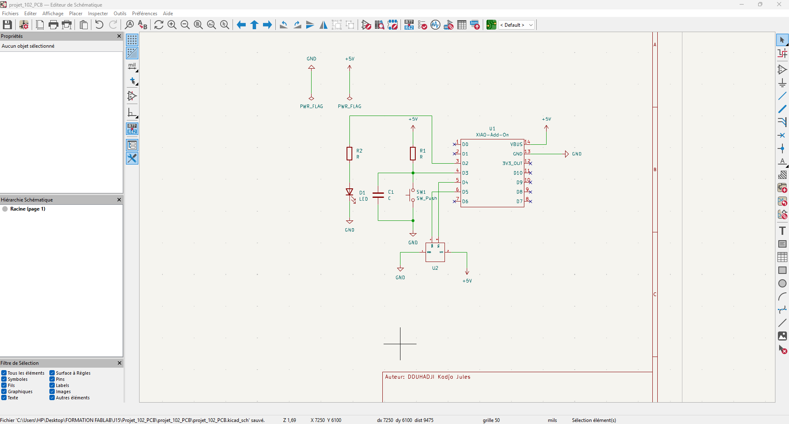
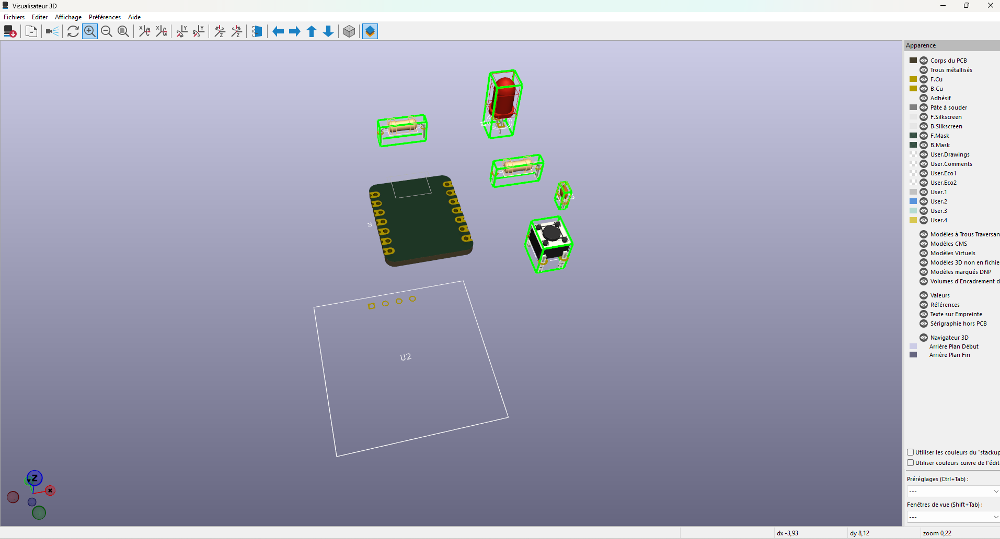

# Journal du mercredi 09 Septembre 2026 réalisé par DOUHADJI Kodjo Jules

##  I- Fait aujourd'hui

Aujourd'hui nous avons fait un (01) atelier pratique de conception de circuit PCB de A à Z

### A- Atelier de Fusion
---

#### 1- Appris

- Nous avons pour mission de réaliser un circuit dans le logiciel KiCad

Circuit à réaliser

- Il a été question notamment comment faire les paramétrages pour le posage, la face, le contour adaptatif, le contour afin de générer le G-Code qui sera utiliser pour fabriquer la pièce

- Graduellement, nous avons appris:

    - à représenter le schématique dans KiCad
    - à importer de bibliothèque
    -  les composants non disponible, nous avons appris à les modéliser en se servant de leur datasheet
    - à assigner les composants
    - à visualiser la vue en 3D

Schématique

Vue en 3D

