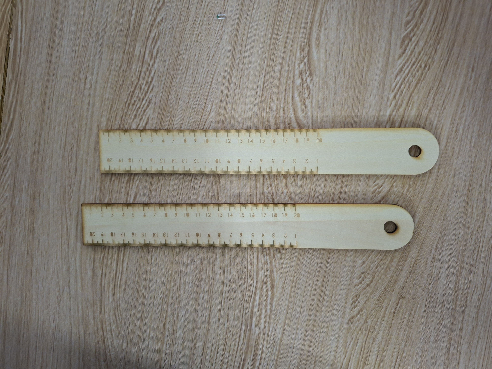

# Journal du Jeudi 10 Septembre 2026 réalisé par DOUHADJI Kodjo Jules

##  Fait aujourd'hui

Aujourd'hui nous avons évoluer sur nos projets notamment avec la modélisation et nous sommes passer au découpe sur le P3. Pour le choix du matériau, nous étions indécis, entre le bois et l'acrylique. Finalement nous avons fait les deux et constater que le meilleur rendu est obtenu avec le bois, ce que nous avons gardé finalement

