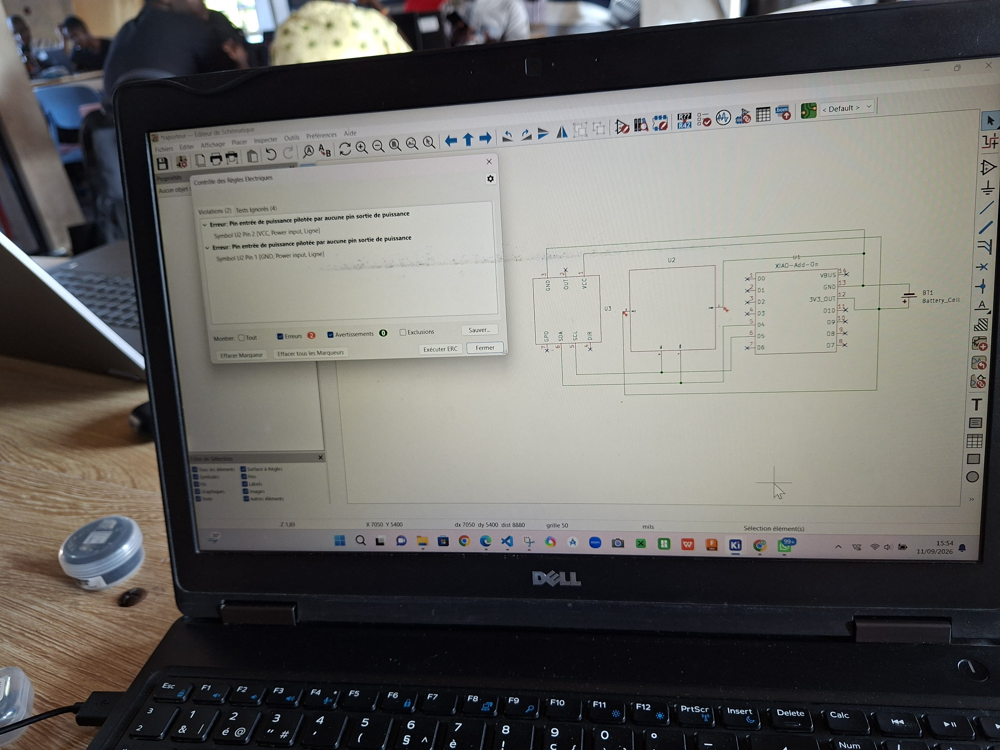
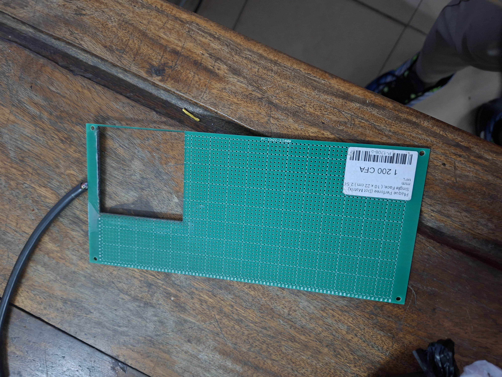

# Journal du Vendredi 11 Septembre 2026 réalisé par DOUHADJI Kodjo Jules

##  Fait aujourd'hui

Jour 2 de travail intensif sur le projet, aujourd'hui il a été question de travailler sur la partie PCB du projet. Nous avons réaliser le schématique après avoir fait la connexion fonctionnelle sur le breadboard.

