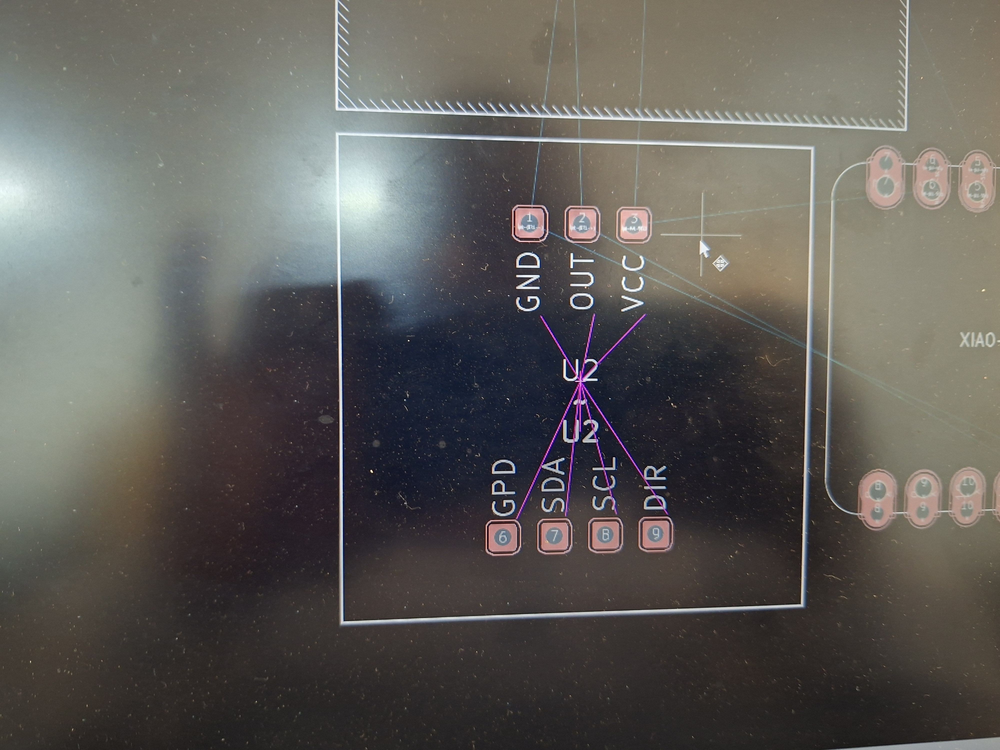

# Journal du Lundi 14 Septembre 2026 réalisé par DOUHADJI Kodjo Jules

##  Fait aujourd'hui

Jour 4 de travail sur le projet, aujourd'hui nous avons été un peu déçus parce que notre composant phare le capteur gyroscopique AS5600 que nous attendons n'est pas arrivé alors qu'on l'attendait histoire de finir le faire les premier test. Comme cela ne suffisait pas quand nous voulons passer du schématique à l'empreinte dans Kicad, son autoroutage connecte le GND au VCC que l'on ne comprennait pas le pourquoi. Nous avons finalement décider de passer au plaquette perforée pour notre circuit imprimé.

