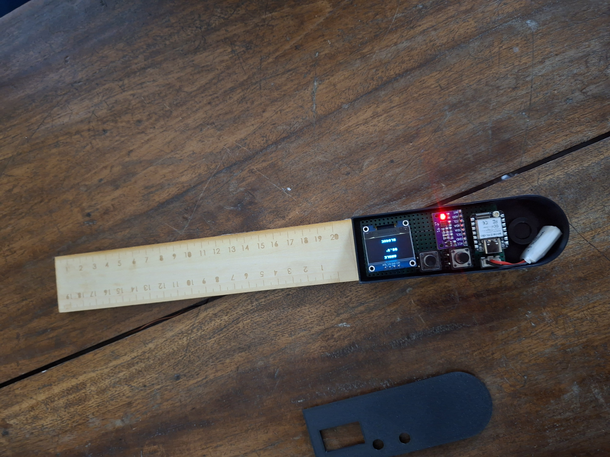

# Journal du Mercredi 16 Septembre 2026 réalisé par DOUHADJI Kodjo Jules

##  Fait aujourd'hui

Jour 7 de travail sur le projet, le dernier jour avant la soutenance, après des test et de modification de code, notre projet de rapporteur numérique reprend forme parce qu'on a eu un premier résultat concluant avec un peu d'erreur car le capteur semble ne pas le être adapté

